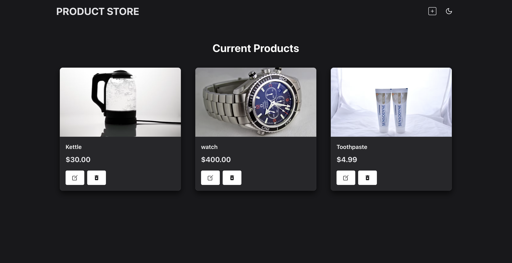
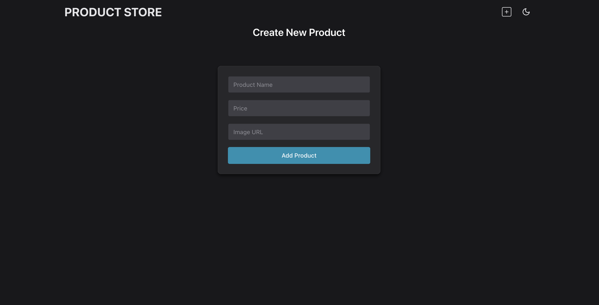

# MERN website

A full-stack web application built using the MERN stack (MongoDB, Express, React, Node.js). This Project serves as a fondation for further learning and experimentation. 

## 🌐 Preview 
### Home Page

### Create Page


## 🛠️ Technologies
- **MongoDb:** Database for storing information.
- **Express.js:** Backend web framework for Node.js.
- **React:** Frontend library for building user interfaces.
- **Node.js:** JavaScript runtime for the backend.
- **Chakra UI:** For building a responsive and accessible user interface with built-in support for light and dark themes.

## 🚀 Features
- **CRUD Operations:** Create, read, update and delete data.
- **REST API:** Enables communication between the frontend and backend.
- **State Management:** React hooks for managing state.
- **Responsive Design:** Optimized UI for different screen sizes.
- **Dark Mode:** User can toggle between light and dark themes.

## 📦 Installation
### Create a .env file in the backend directory
```bash
MONGO_URI= <your MongoDB connection URI>  
PORT= 5005
```

### Run this app locally
```bash
npm run build
```

### Start the app
```bash
npm run start
```

## License
This project is licensed under the MIT License - see the [LICENSE](LICENSE) file for details.

